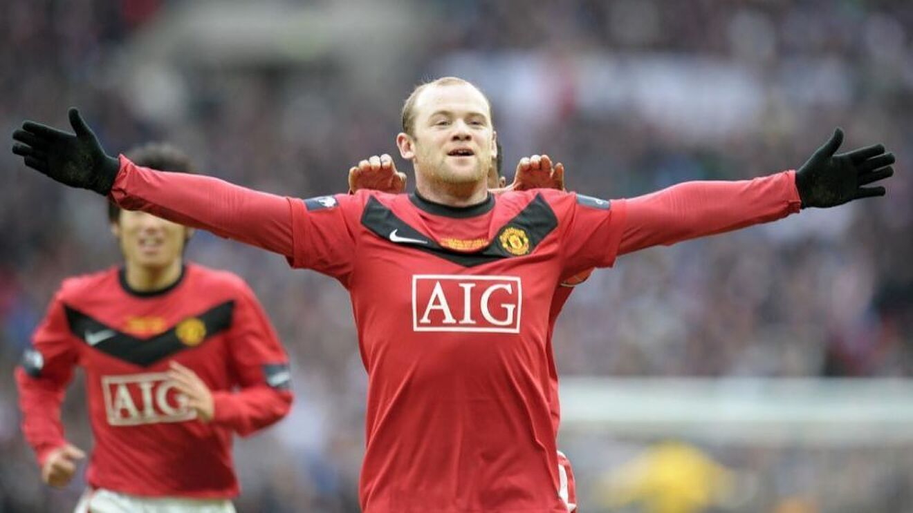
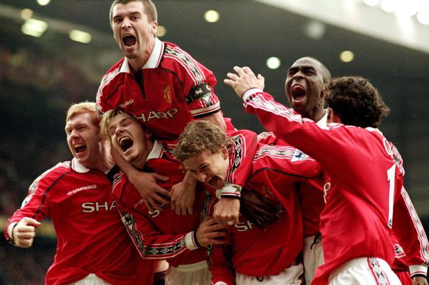

<!DOCTYPE html>
<html>
            <meta charset="UTF-8">
            <meta name="viewport" content="width=device-width, initial -scale=1">

    <body style="background-color:LightCoral;">

            

  
  <a href="file:///C:/Users/s00196499/Desktop/Joes%20Wesbsite/indext.html">Home Page</a>
  <a href="file:///C:/Users/s00196499/Desktop/Joes%20Wesbsite/News.html">News</a>
  <a href="file:///C:/Users/s00196499/Desktop/Joes%20Wesbsite/Match%20Reports.html">Match Reports</a>
  <a href="file:///C:/Users/s00196499/Desktop/Joes%20Wesbsite/Match%20Highlights.html">Match Highlights</a>

  

    <h1 style="text-align:center;">The United Stand</h1>
    <h3 style="text-align:center;">Manchester United News & Updates. By The Fans for The fans.<h3>

 

<body>
    <h4>
        
Created in April of 2022, The United Stand is a Manchester United Fanpage Where We Strive to Bring.

        
 Only the Highest Standard of Content Directly to You.

        
 Our Content is Driven by Our Loyal Fans, We Bring What the People Want to See.
     
    </h4>

    
          

    
    <body>

        <h2 style="text-align:center;">What the United Stand Has to Offer</h2>
        <ol>
            <li style="text-align:center;">Squad News: Transfers, Interviews, Injuries & Behind the Scenes</li>
            <li style="text-align:center;">Match Reports: In Depth Analysis and Reports After Every Match</li>
            <li style="text-align:center;">Top Articles from our Experienced Writers</li>
            <li style="text-align:center;">Match & Player Highlights</li>

        </body>

        

    
                     

        

    

    
        <h1 style="text-align:center;">The United Stand</h1>
        <h3 style="text-align:center;">Manchester United News & Updates. By The Fans for The fans.<h3>
    
 
 

</html>

<!DOCTYPE html>
<html>

  <meta charset="UTF-8">
  <meta name="viewport" content="width=device-width, initial -scale=1">

<body style="background-color:LightCoral;">

            

    

      
      <a href="file:///C:/Users/s00196499/Desktop/Joes%20Wesbsite/indext.html">Home Page</a>
      <a href="file:///C:/Users/s00196499/Desktop/Joes%20Wesbsite/News.html">News</a>
      <a href="file:///C:/Users/s00196499/Desktop/Joes%20Wesbsite/Match%20Reports.html">Match Reports</a>
      <a href="file:///C:/Users/s00196499/Desktop/Joes%20Wesbsite/Match%20Highlights.html">Match Highlights</a>
    
    
    

    
    

    
        <h1 style="text-align:center;">The United Stand</h1>
        <h3 style="text-align:center;">Manchester United News & Updates. By The Fans for The fans.<h3>
    
 

    <h1 style="text-align: center;">United vs Norwich Highlights</h1>

<video width="1500" height="800" controls>
  <source src="match.mp4" type="video/mp4">
  <source src="match.mp4" type="video/ogg">
  Your browser does not support the video tag.
</video>

<h1 style="text-align: center;">Jadon Sancho Skills and Highlights</h1>
<video width="1500" height="800" controls>
  <source src="sancho.mp4" type="video/mp4">
  <source src="sancho.mp4" type="video/ogg">
  Your browser does not support the video tag.
</video>

    <h1 style="text-align:center;">The United Stand</h1>
    <h3 style="text-align:center;">Manchester United News & Updates. By The Fans for The fans.<h3>

 

</html>

                <!DOCTYPE html>
</html>

<meta charset="UTF-8">
<meta name="viewport" content="width=device-width, initial -scale=1">

<body style="background-color:LightCoral;">

    

     
      <a href="file:///C:/Users/s00196499/Desktop/Joes%20Wesbsite/indext.html">Home Page</a>
      <a href="file:///C:/Users/s00196499/Desktop/Joes%20Wesbsite/News.html">News</a>
      <a href="file:///C:/Users/s00196499/Desktop/Joes%20Wesbsite/Match%20Reports.html">Match Reports</a>
      <a href="file:///C:/Users/s00196499/Desktop/Joes%20Wesbsite/Match%20Highlights.html">Match Highlights</a>

    
    

    
    

    
        <h1 style="text-align:center;">The United Stand</h1>
        <h3 style="text-align:center;">Manchester United News & Updates. By The Fans for The fans.<h3>
    
 
    

    
      <table class="tg">
      <thead>
        <tr>
          <th class="tg-i81m">Position</th>
          <th class="tg-i81m">Team</th>
          <th class="tg-i81m">Games Played</th>
          <th class="tg-i81m">Points</th>
          <th class="tg-l0f3">Wins</th>
          <th class="tg-v8f3">Draw</th>
          <th class="tg-cmwg">Loss</th>
          <th class="tg-i81m">Goal Difference</th>
        </tr>
      </thead>
      <tbody>
        <tr>
          <td class="tg-d78e">1</td>
          <td class="tg-xa3o">Manchester City</td>
          <td class="tg-i81m">34</td>
          <td class="tg-i81m">83</td>
          <td class="tg-l0f3">26</td>
          <td class="tg-v8f3">5</td>
          <td class="tg-cmwg">3</td>
          <td class="tg-i81m">+63</td>
        </tr>
        <tr>
          <td class="tg-3uo6">2</td>
          <td class="tg-xa3o">Liverpool</td>
          <td class="tg-i81m">34</td>
          <td class="tg-i81m">82</td>
          <td class="tg-l0f3">25</td>
          <td class="tg-v8f3">7</td>
          <td class="tg-cmwg">2</td>
          <td class="tg-i81m">+64</td>
        </tr>
        <tr>
          <td class="tg-d78e">3</td>
          <td class="tg-xa3o">Chelsea</td>
          <td class="tg-i81m">34</td>
          <td class="tg-i81m">66</td>
          <td class="tg-l0f3">19</td>
          <td class="tg-v8f3">9</td>
          <td class="tg-cmwg">6</td>
          <td class="tg-i81m">+39</td>
        </tr>
        <tr>
          <td class="tg-d78e">4</td>
          <td class="tg-xa3o">Arsenal</td>
          <td class="tg-i81m">34</td>
          <td class="tg-i81m">63</td>
          <td class="tg-l0f3">20</td>
          <td class="tg-v8f3">3</td>
          <td class="tg-cmwg">11</td>
          <td class="tg-i81m">+13</td>
        </tr>
        <tr>
          <td class="tg-cmwg">5</td>
          <td class="tg-cmwg">Tottenham</td>
          <td class="tg-i81m">34</td>
          <td class="tg-i81m">61</td>
          <td class="tg-l0f3">19</td>
          <td class="tg-v8f3">4</td>
          <td class="tg-cmwg">11</td>
          <td class="tg-i81m">+20</td>
        </tr>
        <tr>
          <td class="tg-cmwg">6</td>
          <td class="tg-cmwg">Manchester United</td>
          <td class="tg-i81m">36</td>
          <td class="tg-i81m">58</td>
          <td class="tg-l0f3">16</td>
          <td class="tg-v8f3">10</td>
          <td class="tg-cmwg">10</td>
          <td class="tg-i81m">+5</td>
        </tr>
        <tr>
          <td class="tg-cmwg">7</td>
          <td class="tg-cmwg">West Ham</td>
          <td class="tg-i81m">35</td>
          <td class="tg-i81m">52</td>
          <td class="tg-l0f3">15</td>
          <td class="tg-v8f3">13</td>
          <td class="tg-cmwg">13</td>
          <td class="tg-i81m">+7</td>
        </tr>
        <tr>
          <td class="tg-cmwg">8</td>
          <td class="tg-cmwg">Wolves</td>
          <td class="tg-i81m">34</td>
          <td class="tg-i81m">49</td>
          <td class="tg-l0f3">15</td>
          <td class="tg-v8f3">15</td>
          <td class="tg-cmwg">15</td>
          <td class="tg-i81m">+1</td>
        </tr>
      </tbody>
      </table>

      

    

    
      <table class="tg">
      <thead>
        <tr>
          <th class="tg-wcy2">United Versus Norwich Match Report</th>
        </tr>
      </thead>
      <tbody>
        <tr>
          <td class="tg-bzci">Cristiano Ronaldo scored a second successive Premier League hat trick at Old Trafford to edge Manchester United to a 3-2 victory against Norwich City. Our no.7 scored two goals first half and a bullet free kick in the second to see of a plucky challenge from Norwich, who are facing a drop to the championship.  Ronaldo had put us 2-0 up after half an hour but a Kieran Dowell goal in the first 45 and another early in the second from Teemu Puki dragged Norwich back level. But Ronaldo had the final say, winning it in the 76th minute with a screaming set piece to grab his second match ball in over a month, after hitting a hatrick against Spurs previously. It was a nervous but vital 3 points for the Red Devils.   </td>
        </tr>
      </tbody>
      </table>
    
      

        <h1 style="text-align:center;">The United Stand</h1>
        <h3 style="text-align:center;">Manchester United News & Updates. By The Fans for The fans.<h3>
    
 

      </html>

